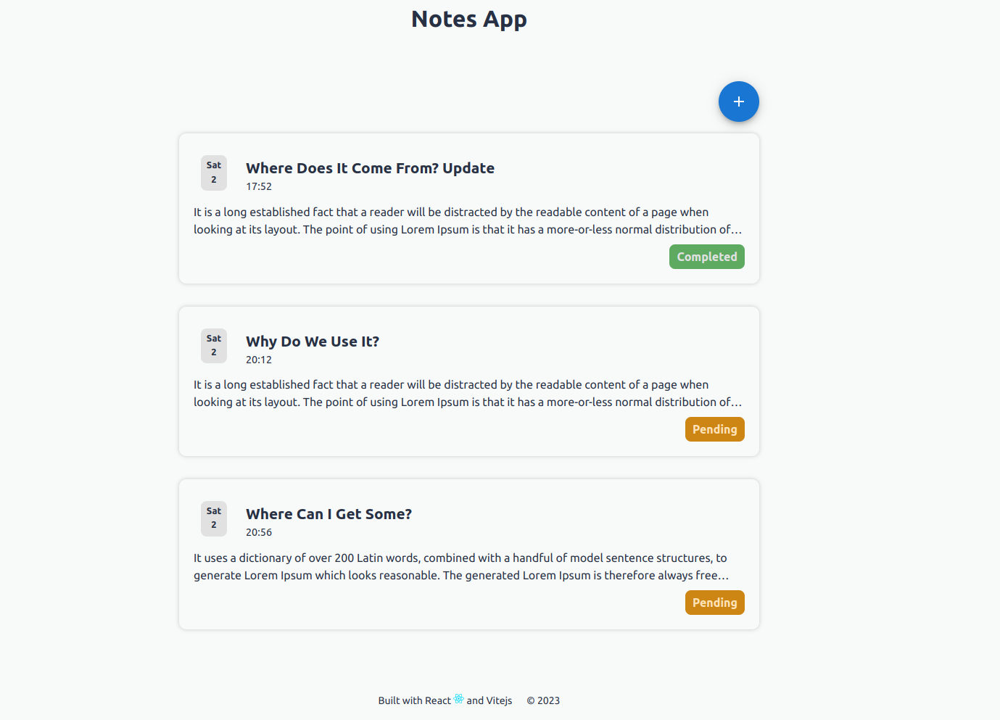
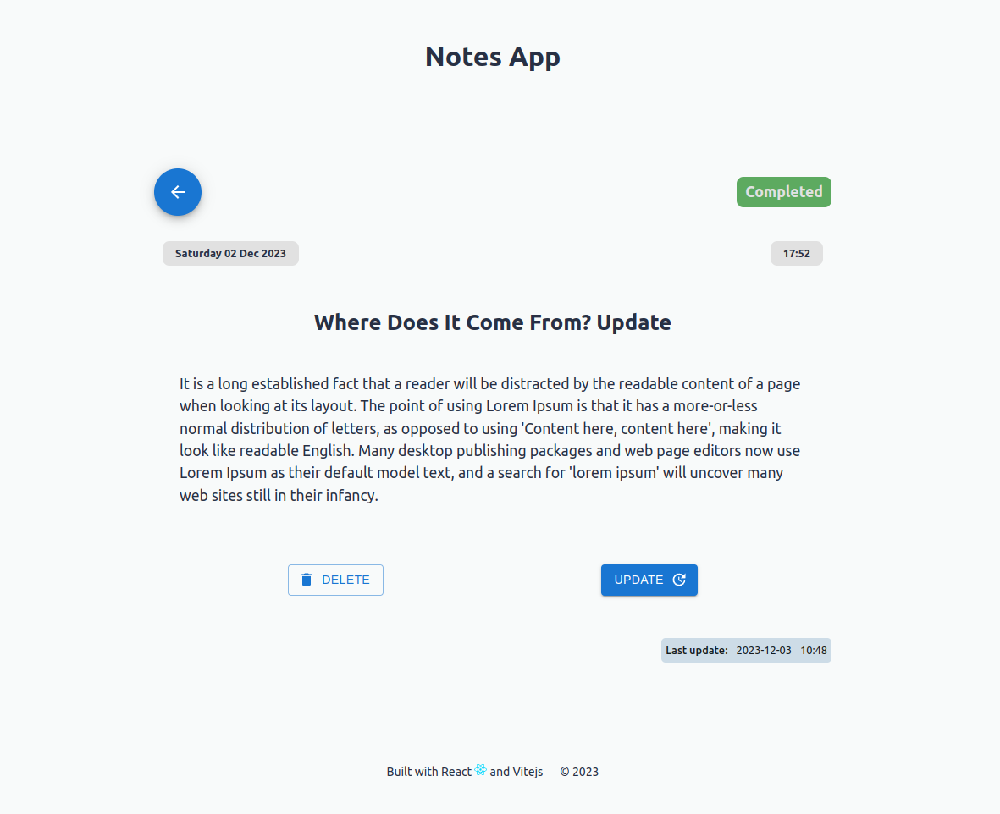

# Project Full Stack App with Vitejs, React 18.2, PrismaORM, Nodejs, Express




Web app that allows manage notes through a SQL database CRUD create with Nodejs, Express and PrismaORM.

Check out the site here: [https://notes-app-production-bd97.up.railway.app/](https://notes-app-production-bd97.up.railway.app/)

---

## Features

In this project, it demonstrates the ability to:

- List of notes.
- CRUD Operation on DB.
- Responsive UI.

---

## Future Features

- Authentication.
- Archive notes.

---

## 🚀 Getting started

### Prerequisites:

- **Node version 14.x**

If you want to run the site locally, you can:

1. Clone the project.

```bash
https://github.com/Johndev85/notes-app.git
```

2. Go to project's folder

```bash
cd notes-app
```

3. Open server:

```bash
npm i
```

```bash
npm run dev
```

4. Open frontend:

```bash
cd client
```

```bash
npm i
```

```bash
npm run dev
```

---

## 🛠 Deployment

- Deploy: [https://railway.app/ ](https://railway.app/)

---

## 🧾 License

- The MIT License (MIT)

---

## ➕ Contributing

- If you want to contribute with this project, just make a Pull Request explaining the improving ✨.

---

## 💻 Technologies:

- React
- Vitejs
- Prisma ORM
- Nodejs
- Express
- JavaScript
- CSS3
- HTML5
- Railway

---
